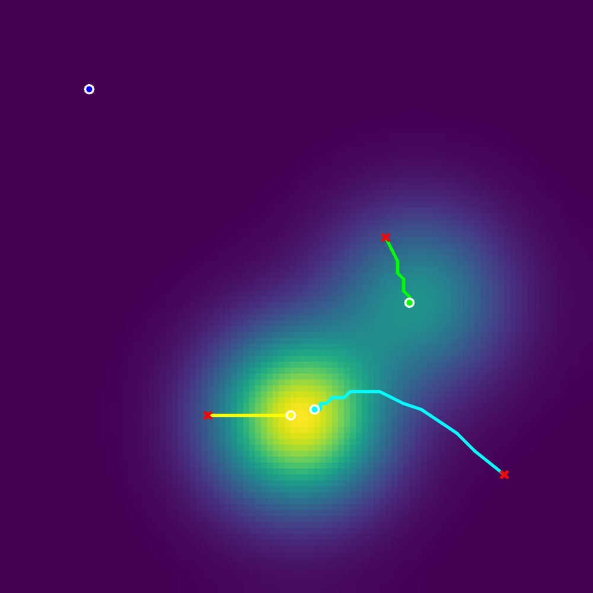
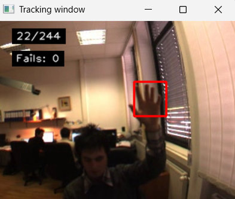
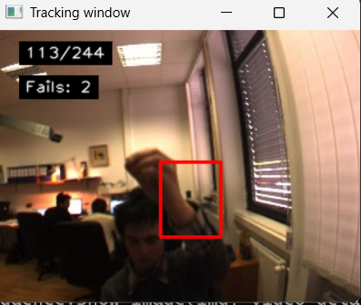

# Mean-Shift Tracking

This assignment is about mean-shift tracking. I implemented mean-shift mode seeking on response maps and then used the same idea for a color-based tracker on VOT2014 sequences.

## What I did

- Implemented mean-shift mode seeking with Epanechnikov and Gaussian kernels.
- Tested different bandwidths, stopping thresholds, and starting points.
- Implemented a color histogram tracker with mean-shift localization.
- Evaluated the tracker with VOT-style reset after failure.
- Compared parameter choices such as histogram bins, kernel size, update speed, and color space.
- Added a background histogram experiment.

## Results

Required VOT2014 subset:

| Sequence | FPS | Failures |
| --- | ---: | ---: |
| polarbear | 381.0 | 0 |
| hand1 | 289.6 | 4 |
| fernando | 87.1 | 1 |
| drunk | 169.7 | 0 |
| basketball | 224.2 | 1 |
| Average / total | 230.3 | 6 |

Some observations from the experiments:

- `hand1` was the hardest sequence because fast hand motion and blur often moved the tracker away from the target.
- `polarbear` had no official failures, although the white target and snow background were visually similar.
- Background modeling reduced total failures from 6 to 5 in the bonus experiment.
- In my tests, BGR worked better than HSV, Lab, and YCrCb for this tracker setup.

## Example figures

Mean-shift paths from the mode-seeking experiment:



Example good and bad tracking cases:





## Files

```text
ms-material/
  run_mode_seeking.py          # Mean-shift mode seeking experiments
  ms_tracker.py                # Mean-shift tracker
  run_tracker.py               # Tracking runner
  run_tracker_experiments.py   # Parameter tests
main.tex                       # Report source
main.pdf                       # Compiled report
*-good-case.png / *-bad-case.png
```

## How to run

```bash
cd ms-material
python run_mode_seeking.py
python run_tracker_experiments.py
```

The full VOT2014 dataset is excluded from the repository version because it contains many image frames.

## Tools

- Python
- NumPy
- OpenCV
- Matplotlib
- VOT2014-style tracking evaluation
